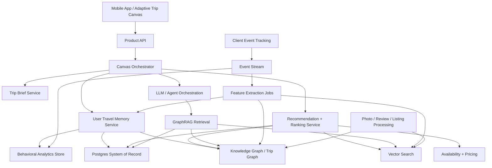

# Backend Tech Spec: User Travel Memory and GraphRAG Architecture

**Document:** `02_Backend_Tech_Spec_User_Travel_Memory_GraphRAG.md`  
**Related PRD:** [01_PRD_AI_Native_Airbnb_Adaptive_Trip_Canvas.md](./01_PRD_AI_Native_Airbnb_Adaptive_Trip_Canvas.md)  
**Related Agent Build Prompt:** [airbnb_ai_native_agent_prompt.md](./airbnb_ai_native_agent_prompt.md)  
**Project:** AI-Native Airbnb Adaptive Trip Canvas  
**Primary Goal:** Explain the backend architecture required to generate the frontend experience and user flows defined in the PRD.  

---

## 1. Purpose

This backend tech spec explains how the AI-native Airbnb Adaptive Trip Canvas could be powered.

The system must answer questions like:

- Why is this user opening Airbnb now?
- What trip are they likely trying to plan?
- Which past trips are relevant?
- Which homes, experiences, and services match that pattern?
- What details does this specific user care about most?
- How should the canvas change when the user speaks, taps, circles, saves, rejects, or edits something?
- How can the system explain recommendations without sounding creepy?

This is not a simple chatbot backend.

It is a hybrid personalization, analytics, retrieval, recommendation, graph reasoning, and LLM orchestration system.

---

## 2. Architecture Thesis

The ideal architecture is hybrid.

It should combine:

```text
Postgres / relational system of record
+ historical user analytics
+ event stream and behavioral feature extraction
+ User Travel Memory
+ vector search
+ knowledge graph / trip graph
+ GraphRAG retrieval
+ recommendation and ranking layer
+ multimodal image understanding
+ LLM orchestration
+ live canvas session state
```

No single system is enough.

A vector database alone cannot understand trip structure.  
A graph database alone cannot retrieve semantically similar bathrooms or reviews.  
An LLM alone should not decide rankings, prices, availability, or explanations.  
Postgres alone cannot infer subtle semantic similarity or visual preferences.

The correct model is:

> Structured facts in Postgres, behavior in analytics, relationships in a graph, similarity in vector search, decisions in ranking, conversation in the LLM, and live state in the canvas session.

---

## 3. High-Level System Diagram



---

## 4. Core Product Capabilities This Backend Must Enable

The backend must support these frontend capabilities from the PRD:

1. Generate a personalized home screen from seasonal intent.
2. Show past homes, new similar homes, experiences, and services together.
3. Reconstruct or repeat last year's trip.
4. Improve last year's trip around qualitative changes like quieter, cheaper, or better Wi-Fi.
5. Personalize listing detail pages based on what the user usually inspects.
6. Let the user circle images and convert visual feedback into search criteria.
7. Optionally support a future mixed-item trip builder that bundles homes, experiences, and services together.
8. Let the user review and remix a past itinerary.
9. Keep a live Trip Brief synchronized with every interaction.
10. Explain recommendations using evidence without exposing creepy raw analytics.

---

## 5. Core Data Objects

The backend should model the product around trips, not only listings.

```text
User
├── User Travel Memory
├── Past Trips
│   ├── Homes
│   ├── Experiences
│   ├── Services
│   ├── Itinerary Days
│   ├── Budget
│   ├── Dates
│   └── Feedback
├── Behavioral Analytics
├── Current Trip Brief
└── Current Canvas Session
```

### Main Objects

| Object | Purpose |
|---|---|
| User | Account and identity |
| Trip | Multi-day travel object composed of homes, experiences, services, schedule, and budget |
| Home | Stay listing |
| Experience | Activity or event |
| Service | Pickup, grocery delivery, chef, cleaning, etc. |
| Review | Review text, ratings, extracted signals |
| Photo | Listing image, room type, visual attributes |
| UserEvent | Raw behavioral event |
| UserTravelMemory | Derived long-term preference profile |
| TripBrief | Live editable intent object |
| CanvasSession | Current frontend canvas state |
| RecommendationCandidate | Home/experience/service/bundle candidate |
| ExplanationReason | Reason codes shown in UI |

---

## 6. Structured System of Record

Use Postgres as the canonical system of record.

Postgres stores:

```text
users
profiles
homes
experiences
services
bookings
trips
itinerary_items
saved_items
availability
pricing
reviews
photos
amenities
locations
user_events
trip_briefs
canvas_sessions
```

Recommended Postgres extensions/features:

- JSONB for flexible metadata
- PostGIS for geo/location queries
- pgvector for prototype vector search or smaller-scale semantic retrieval

Postgres should own hard facts:

- Did this user book this home?
- Is this home available?
- What is the price?
- What services are bookable?
- What experiences are available on this date?
- What are the official listing amenities?

---

## 7. Historical User Analytics and Behavioral Decision Signals

This is a first-class part of the architecture.

Bookings and purchases show what the user committed to. Behavioral analytics show how the user made the decision.

The system should collect and analyze long-term app behavior, including:

### Search Behavior

- Searches by location
- Searches by date range
- Searches by trip type
- Repeated searches in the same region
- Time spent comparing destinations
- Seasonal search patterns
- Search refinements
- Abandoned searches

### Listing Behavior

- Homes viewed
- Time spent on each home
- Scroll depth
- Listing sections opened
- Repeatedly revisited homes
- Similar listings viewed before booking
- Listing abandonment points

### Photo Behavior

- Photo gallery opened
- Photo dwell time
- Room types viewed longest
- Bathroom photos inspected
- Balcony/view photos inspected
- Workspace photos inspected
- Photos skipped quickly
- Images circled or marked up in Feedback Mode

### Filter Behavior

- Filters applied
- Filters removed
- Filters repeatedly used
- Budget ranges explored
- Map zoom and pan behavior
- Neighborhoods inspected
- Amenities toggled

### Review Behavior

- Review sections opened
- Keywords searched in reviews
- Wi-Fi reviews expanded
- Noise-related reviews expanded
- Family-related reviews expanded
- Host responsiveness checked
- Cancellation policy inspected

### Decision Behavior

- Homes saved
- Homes hidden
- Homes compared
- Homes shared
- Homes abandoned after seeing price
- Homes abandoned after seeing location
- Homes abandoned after seeing photos
- Homes revisited before booking

### Purchase Behavior

- Homes booked
- Experiences booked
- Services booked
- Total spend per trip
- Spend by category
- Average nightly budget
- Upgrade willingness
- Cancellation behavior
- Rebooking behavior

### Trip Behavior

- Trip duration
- Time of year
- Planning lead time
- Repeat destinations
- Repeat property types
- Arrival services used
- Experiences booked mid-trip
- Family or solo patterns

---

## 8. Behavioral Feature Extraction

Raw analytics should not be passed directly into the LLM.

Raw events should be transformed into durable signals.

Examples:

| Raw Behavior | Derived Signal |
|---|---|
| User repeatedly opens Wi-Fi review sections | Strong Wi-Fi reliability preference |
| User spends high dwell time on bathroom photos | Bathroom quality influences decisions |
| User searches coastal homes every April and books July trips | Seasonal July seaside planning pattern |
| User saves premium homes but books mid-budget homes | Aspirational browsing, mid-budget purchase pattern |
| User hides homes near nightlife zones | Avoid noisy tourist centers |
| User books airport pickup on family trips | Arrival convenience preference |
| User repeatedly compares balconies/views | Balcony/view quality preference |

Feature extraction should include:

- Frequency weighting
- Recency weighting
- Seasonality detection
- Preference strength scoring
- Negative signal detection
- Intent prediction
- Decision-stage modeling
- Purchase-vs-browse distinction
- Confidence scoring

Example derived memory:

```json
{
  "seasonal_patterns": [
    {
      "trigger_months": ["March", "April"],
      "likely_intent": "plan July seaside trip",
      "confidence": 0.86,
      "evidence": ["2019", "2021", "2022", "2023", "2025"]
    }
  ],
  "decision_signals": {
    "wifi_reliability": "high",
    "bathroom_natural_light": "medium",
    "balcony_view": "high",
    "quiet_area": "high",
    "family_activities": "medium"
  },
  "spend_patterns": {
    "typical_july_trip_total": "€1800–€2600",
    "nightly_home_budget": "€120–€180",
    "upgrade_willingness": "moderate"
  }
}
```

---

## 9. User Travel Memory Layer

The User Travel Memory layer is the persistent profile that powers personalization.

It includes:

```text
Explicit preferences
Inferred preferences
Behavioral analytics-derived preferences
Purchase-derived preferences
Seasonal planning patterns
Dealbreakers
Repeated decision behaviors
Spend patterns
Past trip archetypes
```

Example:

```json
{
  "user_id": "alex",
  "travel_memory": {
    "seasonal_intent": "likely July seaside planning in March/April",
    "destination_patterns": ["coastal Europe", "quiet seaside towns"],
    "stay_preferences": ["entire home", "strong Wi-Fi", "workspace", "balcony"],
    "experience_preferences": ["food walks", "nature walks", "family activities"],
    "service_preferences": ["airport pickup", "grocery delivery"],
    "dealbreakers": ["nightlife zones", "dark bathrooms", "weak Wi-Fi"],
    "inspection_patterns": ["Wi-Fi reviews", "bathroom photos", "balcony photos"],
    "budget_pattern": "mid-to-upper-mid range"
  }
}
```

The frontend should never expose raw analytics directly. It should expose helpful derived statements:

Good:

> Based on your past summer trips, I prioritized quiet coastal homes with strong Wi-Fi and balcony views.

Bad:

> You opened 19 balcony photos and spent 4 minutes reading Wi-Fi reviews last year.

---

## 10. Vector Search Layer

Vector search handles semantic similarity.

Use cases:

- Find homes similar to Casa Mare
- Find new destinations with the same “quiet coastal” feel
- Find reviews semantically related to Wi-Fi reliability
- Find experiences similar to food walks
- Find services similar to prior arrival patterns
- Find photos with similar bathroom or balcony style
- Find listings matching “like this, but with natural light”

Embeddings should be generated for:

```text
listing descriptions
reviews
host descriptions
amenities
neighborhood descriptions
experience descriptions
service descriptions
photo captions
image attributes
user requests
trip summaries
```

Recommended tools:

| Use Case | Tool |
|---|---|
| Prototype / simple stack | Postgres + pgvector |
| Production vector search | Qdrant, Weaviate, Milvus, or Pinecone |
| Hybrid text + vector search | Qdrant / OpenSearch + vector support |
| Image/text multimodal retrieval | CLIP-like image embeddings or hosted multimodal embedding models |

---

## 11. Knowledge Graph / Trip Graph Layer

The graph layer models relationships.

Graph nodes:

```text
User
Trip
Home
Experience
Service
Location
Season
Photo
Review
Amenity
Preference
Constraint
FeedbackSignal
ItineraryItem
```

Graph edges:

```text
User BOOKED Trip
Trip INCLUDED Home
Trip INCLUDED Experience
Trip INCLUDED Service
Trip OCCURRED_IN July
Trip PLANNED_IN April
Home LOCATED_NEAR Sea
Home HAS_AMENITY Workspace
Home HAS_PHOTO BathroomPhoto
Review MENTIONS Wi-Fi
User INSPECTED Wi-FiReviews
User PREFERS QuietArea
User REJECTED NightlifeZone
Photo SHOWS Bathroom
Photo HAS_ATTRIBUTE NaturalLight
Service USED_ON ArrivalDay
Experience SCHEDULED_ON Day2
```

The graph helps answer:

- What does this user usually do in July?
- Which prior trips are most similar to this current intent?
- Which services usually accompany this type of trip?
- Which homes are similar in relationship structure, not just text?
- What did this user inspect before booking?
- Which trip bundle is most consistent with past behavior?

Recommended tools:

- Neo4j for graph database and graph querying
- Neo4j GraphRAG for graph-backed retrieval and LLM context
- NetworkX for prototype graph operations
- LlamaIndex or LangChain graph integrations for prototype experiments

---

## 12. GraphRAG Layer

GraphRAG should be used when the AI needs relationship-aware context plus generative explanation.

Example user question:

> Why are you showing me this Portugal home?

GraphRAG retrieves:

```text
Past Croatia trip
Past Portugal saved home
Preference for quiet coastal towns
Repeated Wi-Fi review inspection
Similar balcony/view attributes
July availability
Lower price than last year
```

Then the LLM explains:

> I’m showing this because it keeps the quiet coastal pattern from your past July trips, has stronger Wi-Fi evidence, and is available in your usual July window.

GraphRAG is especially useful for:

- Explaining recommendations
- Comparing new options to past trips
- Reconstructing last year's trip
- Bundling homes + experiences + services
- Connecting seasonal intent to past behavior
- Supporting itinerary remixing

---

## 13. Frontend Flow to Backend Capability Mapping

This section ties the backend architecture directly to the PRD flows.

See PRD: [Root User Flow, Active Branches, and Future Concept](./01_PRD_AI_Native_Airbnb_Adaptive_Trip_Canvas.md#10-root-user-flow-active-branches-and-future-concept)

### 13.1 Root Flow: Adaptive Trip Canvas Appears

Frontend behavior:

User opens Airbnb in April. The app shows:

> Planning your July sea trip?

Backend services required:

| Frontend Element | Backend Capability |
|---|---|
| Seasonal prompt | Seasonal intent detection from historical analytics |
| Past favorites | Trip graph + bookings + saved items |
| New similar homes | Vector search + structured filters + ranking |
| Experiences | Experience preference model + availability |
| Services | Service usage history + service recommendation |
| Trip Brief | User Travel Memory + Trip Brief generator |
| “Why this fits” | Reason codes + GraphRAG explanation |
| Quick chips | Precomputed likely refinement paths |

Backend flow:

```text
App open
↓
Get user profile
↓
Check User Travel Memory
↓
Detect seasonal intent
↓
Retrieve relevant past trips
↓
Generate candidates
↓
Rank homes, experiences, services
↓
Generate Trip Brief
↓
Return canvas state
```

### 13.2 Branch 1: Repeat Last Year

Frontend behavior:

User taps:

> Do what I did last year.

Backend services required:

| Frontend Element | Backend Capability |
|---|---|
| Previous trip package | Past trip reconstruction |
| Same home | Booking history + availability check |
| Similar fallback home | Vector retrieval + graph similarity |
| Same service bundle | Service purchase history |
| Similar experience | Experience graph + vector similarity |
| Ready-to-book status | Availability/pricing API |
| Swap any part | Trip bundle mutation logic |

Backend flow:

```text
Retrieve last relevant July trip
↓
Extract home + experience + service bundle
↓
Check current availability
↓
If unavailable, retrieve closest substitutes
↓
Rank by similarity and feasibility
↓
Generate repeat-trip package
```

### 13.3 Branch 2: Same Trip, But Better

Frontend behavior:

User chooses:

> Same trip, but better → Quieter this year.

Backend services required:

| Frontend Element | Backend Capability |
|---|---|
| “Quieter this year” chip | Intent modifier parser |
| Updated Trip Brief | Constraint update service |
| Quieter homes | Review extraction + noise/location signals |
| Less crowded experiences | Experience classification |
| Explanation card | Reason-code generator |
| Regenerated canvas | Candidate reranking |

Backend flow:

```text
Receive modifier: quieter
↓
Update Trip Brief constraints
↓
Retrieve homes matching original trip pattern
↓
Apply quietness signals
↓
Filter out nightlife / tourist-heavy areas
↓
Rerank results
↓
Return regenerated canvas
```

### 13.4 Branch 3: Focus Mode on One Home

Frontend behavior:

User taps a home and opens a personalized listing detail view where the evidence most relevant to that user appears first.

Backend services required:

| Frontend Element | Backend Capability |
|---|---|
| Personalized listing highlights | User inspection analytics + listing evidence |
| Ordered detail sections | Listing-detail personalization |
| Bathroom / balcony / workspace jumps | Photo classification |
| Why-this-fits summary | Reason-code generator |
| User-specific evidence priority | Preference inference from browsing behavior |

Backend flow:

```text
Open home detail
↓
Fetch user inspection priorities
↓
Order listing evidence by user relevance
↓
Return personalized listing detail
```

### 13.5 Branch 3B: Draw-to-Search From Gallery

Frontend behavior:

User opens the gallery, taps the plus menu, enables Draw on screen, circles a bathroom and balcony, and says:

> I want a brighter bathroom. And on this photo, I want a bigger balcony and better view.

Backend services required:

| Frontend Element | Backend Capability |
|---|---|
| Gallery draw mode | Image region capture |
| Continuous voice note | Streaming speech-to-text + utterance grouping |
| Circled image region | Multimodal region understanding |
| Structured visual preference extraction | Multimodal understanding + parser |
| Regenerated homes | Image/text vector search + ranking |
| Updated Trip Brief chips | Trip Brief mutation |

Backend flow:

```text
Open gallery
↓
Enable draw mode
↓
Receive image region + spoken feedback
↓
Extract visual preference
↓
Update Trip Brief
↓
Retrieve homes matching visual criteria
↓
Return regenerated results
```

### 13.6 Branch 4: Future Concept — Mixed-Item Trip Builder

This is a future capability, not part of the active frontend board.

Frontend behavior:

User circles a home, experience, and service, then says:

> Build the trip around these.

Backend services required:

| Frontend Element | Backend Capability |
|---|---|
| Lasso selection | Canvas object identity mapping |
| Selected home/experience/service | Entity graph |
| Bundle generation | Trip composition service |
| Compatibility | Dates, location, schedule, price, availability |
| Bundle explanation | GraphRAG + reason codes |
| Save/compare options | Trip option persistence |

Backend flow:

```text
Receive selected canvas object IDs
↓
Resolve selected entities
↓
Create candidate trip bundle
↓
Check compatibility and availability
↓
Score bundle against Travel Memory
↓
Generate explanation
↓
Return bundle card
```

### 13.7 Branch 5: Itinerary Remix

Frontend behavior:

User opens a saved itinerary from the Trip Brief, taps Remix this itinerary, and says:

> Move the harbor food walk to noon, remove the sunset boat tour, and add something for the kids at 5.

Then the user makes one more spoken edit while voice mode remains active.

Backend services required:

| Frontend Element | Backend Capability |
|---|---|
| Trip Brief entry point | Canvas state + past-trip linkage |
| Past itinerary | Trip reconstruction |
| Day-by-day schedule | Itinerary data model |
| Natural language edit | LLM intent parser |
| Availability checks | Experience/service scheduling |
| Conflict detection | Calendar/time logic |
| Updated itinerary | Trip plan mutation |
| Follow-up spoken edit | Conversation state + itinerary diffing |
| AI availability note | Explanation generator |

Backend flow:

```text
Retrieve past trip itinerary
↓
Parse requested itinerary edits
↓
Remove / move / add itinerary items
↓
Search available replacements
↓
Check time conflicts
↓
Update Trip Brief and itinerary
↓
Return revised schedule
```

---

## 14. Recommendation and Ranking Layer

The ranking layer should be separate from the LLM.

The LLM can explain and orchestrate, but ranking should be controlled by retrieval, scoring, business rules, and model outputs.

Ranking inputs:

```text
availability
price
distance to coast
similarity to past trips
preference match
behavioral signal match
review quality
Wi-Fi evidence
quietness
family fit
visual preference match
service availability
experience availability
novelty
diversity
trust/safety constraints
```

Ranking outputs:

```text
candidate homes
candidate experiences
candidate services
trip bundles
reason codes
confidence scores
tradeoff notes
```

Example reason codes:

```json
{
  "candidate_id": "quiet-seaside-loft-portugal",
  "reason_codes": [
    "similar_to_past_croatia_stay",
    "verified_wifi",
    "quiet_area",
    "balcony_view",
    "lower_than_usual_budget"
  ],
  "confidence": 0.82
}
```

The frontend uses reason codes to display:

> Similar to your Croatia stay  
> Verified Wi-Fi  
> Quieter area  
> Balcony view  
> Lower than your usual budget  

---

## 15. LLM Orchestration Layer

The LLM orchestration layer manages the live session.

Responsibilities:

- Interpret user speech/text
- Detect whether the user is selecting, comparing, rejecting, refining, or booking
- Update the Trip Brief
- Call retrieval tools
- Call ranking services
- Generate user-facing explanations
- Return updated canvas state
- Maintain multi-turn session context

Recommended approach:

- LangGraph-style orchestration for stateful multi-step agent flows
- Tool-calling against backend services
- Typed schemas for Trip Brief updates and canvas updates
- Guardrails preventing the LLM from inventing availability, prices, or listing facts

Possible tools exposed to the orchestrator:

```text
get_user_travel_memory()
detect_seasonal_intent()
retrieve_past_trips()
search_similar_homes()
search_experiences()
search_services()
update_trip_brief()
rank_candidates()
generate_canvas()
compare_options()
check_availability()
reconstruct_itinerary()
mutate_itinerary()
extract_visual_feedback()
```

---

## 16. Multimodal Feedback Mode

This powers image-level preference capture.

Inputs:

```text
home photos
room photos
user-drawn circles
image regions
spoken feedback
existing photo metadata
```

Extracted attributes:

```text
room type
objects
style
natural light
window/skylight
balcony size
view quality
workspace quality
bed style
bathroom features
```

Example:

User circles bathroom and says:

> I want a brighter bathroom.

The system creates:

```json
{
  "target": "bathroom",
  "positive_attributes": ["similar style"],
  "required_changes": ["brighter", "more natural light"],
  "negative_attributes": []
}
```

Then retrieval searches for homes with:

```text
similar style
+ bathroom natural light
+ skylight or window
+ July availability
+ current Trip Brief constraints
```

Prototype version:

- Use mock image tags.
- Use static JSON photo metadata.
- Show the concept visually in the UI.

Production version:

- Use image classification/captioning.
- Use multimodal embeddings.
- Store image-region attributes.
- Use region-level metadata when available.

---

## 17. Adaptive Trip Canvas API Contract

The frontend should receive structured data, not only prose.

Example response:

```json
{
  "canvasSessionId": "session_123",
  "mode": "trip_canvas",
  "tripBrief": {
    "title": "July Sea Trip",
    "dates": "Flexible 7–10 nights in July",
    "vibe": ["quiet", "coastal", "family-friendly"],
    "mustHaves": ["strong Wi-Fi", "workspace", "balcony/view"],
    "avoid": ["nightlife zones", "dark bathrooms"],
    "selectedItems": []
  },
  "sections": [
    {
      "id": "past_favorites",
      "title": "Familiar favorites",
      "cards": []
    },
    {
      "id": "new_matches",
      "title": "Same feeling, new places",
      "cards": []
    },
    {
      "id": "experiences",
      "title": "Experiences that fit this trip",
      "cards": []
    },
    {
      "id": "services",
      "title": "Services for easier arrival",
      "cards": []
    }
  ],
  "nextActions": [
    "Do what I did last year",
    "Same trip, but better",
    "Quieter this year",
    "Lower budget"
  ]
}
```

Example card schema:

```json
{
  "id": "home_123",
  "type": "home",
  "title": "Quiet Seaside Loft, Portugal",
  "subtitle": "Similar to your Croatia stays, but less expensive",
  "image": "placeholder.jpg",
  "reasonCodes": [
    "quiet_area",
    "verified_wifi",
    "balcony_view",
    "lower_than_usual_budget"
  ],
  "actions": ["Show me", "More like this", "Save"]
}
```

---

## 18. Privacy, Consent, and User Control

This system uses deep behavioral personalization, so trust is critical.

Requirements:

- User can view Travel Memory.
- User can edit Travel Memory.
- User can disable personalization.
- User can delete derived preference signals.
- Raw behavioral analytics should not be exposed directly.
- Sensitive inferences should be avoided.
- Recommendations should include clear, helpful explanations.
- Personalization should be scoped to travel behavior.
- Data retention should be transparent.
- System should support GDPR-style deletion/export flows.

Tone matters.

Good:

> Based on your past summer trips, I prioritized quiet coastal homes with strong Wi-Fi.

Bad:

> You spent 4 minutes reading Wi-Fi reviews and opened 19 balcony photos last July.

---

## 19. Prototype Build vs Production Build

### Prototype Build

For the take-home task:

```text
Next.js / React
Tailwind
Mock JSON
Static screen states
Fake User Travel Memory object
Fake Trip Brief updates
Fake recommendation ranking
Fake image metadata
No real backend required
```

The prototype should show the logic visually, not implement the full backend.

### Production Build

For a real system:

```text
Mobile app frontend
Product API
Postgres transactional store
Event streaming pipeline
Behavioral analytics store
Data warehouse/lake
Feature extraction jobs
Feature store
Vector database
Graph database
Recommendation service
LLM orchestration layer
Session state/cache
Multimodal processing
Privacy/consent service
Observability/evaluation layer
```

---

## 20. Recommended Open-Source / Open-Core Tools

| Layer | Tools |
|---|---|
| Product API | Node.js / TypeScript, FastAPI, GraphQL, REST |
| Core DB | PostgreSQL |
| Geo | PostGIS |
| Prototype vector search | pgvector |
| Production vector search | Qdrant, Weaviate, Milvus |
| Graph DB | Neo4j |
| GraphRAG | Neo4j GraphRAG, Microsoft GraphRAG concepts, LlamaIndex graph integrations |
| Agent orchestration | LangGraph |
| Event streaming | Kafka / Redpanda |
| Workflow scheduling | Airflow / Dagster |
| Analytics warehouse | BigQuery, Snowflake, ClickHouse, DuckDB for prototype |
| Feature store | Feast or custom feature tables |
| Search | OpenSearch / Elasticsearch |
| Cache/session | Redis |
| Frontend prototype | React / Next.js / Tailwind |
| Image processing | CLIP-like embeddings, image captioning/tagging pipelines |

---

## 21. Risk and Tradeoffs

### Risk: Personalization feels creepy

Mitigation:

- Use high-level explanations.
- Let user inspect and edit Travel Memory.
- Avoid raw behavioral details.

### Risk: LLM invents facts

Mitigation:

- LLM must retrieve evidence.
- Prices, availability, and amenities come from backend services.
- Use typed tool calls and structured responses.

### Risk: Graph complexity grows too fast

Mitigation:

- Start with a lightweight trip graph.
- Add graph edges only where they support product flows.
- Use Postgres for canonical facts.

### Risk: Vector similarity returns nice-looking but unavailable homes

Mitigation:

- Always combine semantic retrieval with structured filters and availability.

### Risk: Too much UI generation confuses users

Mitigation:

- Keep a stable shell.
- Generate content, not the entire interface.
- Keep Trip Brief visible and editable.

---

## 22. Final Architecture Summary

The Adaptive Trip Canvas is powered by a hybrid backend.

The frontend experience appears simple:

> Planning your July sea trip?

But behind that, the system has:

1. Read long-term behavioral analytics.
2. Detected seasonal intent.
3. Retrieved relevant past trips.
4. Built or updated the User Travel Memory.
5. Queried structured facts from Postgres.
6. Retrieved semantically similar homes, reviews, photos, experiences, and services.
7. Traversed a trip graph to understand relationships.
8. Used GraphRAG to generate explainable context.
9. Ranked candidates with reason codes.
10. Returned a structured canvas state to the mobile app.

The core system is not “LLM + database.”

It is:

> Behavioral analytics + Postgres + User Travel Memory + vector search + trip graph + GraphRAG + ranking + LLM orchestration + structured canvas API.

That is what makes the AI-native frontend believable.

---

## 23. References

These are implementation references for the architecture direction.

- Airbnb 2025 Summer Release: Homes, Services, Experiences, and redesigned app  
  https://news.airbnb.com/airbnb-2025-summer-release/

- Airbnb 2025 Release page  
  https://www.airbnb.com/release

- pgvector: open-source vector similarity search for Postgres  
  https://github.com/pgvector/pgvector

- PostgreSQL pgvector 0.8.0 release announcement  
  https://www.postgresql.org/about/news/pgvector-080-released-2952/

- Neo4j GraphRAG for Python  
  https://neo4j.com/docs/neo4j-graphrag-python/current/

- LangGraph overview  
  https://docs.langchain.com/oss/python/langgraph/overview
